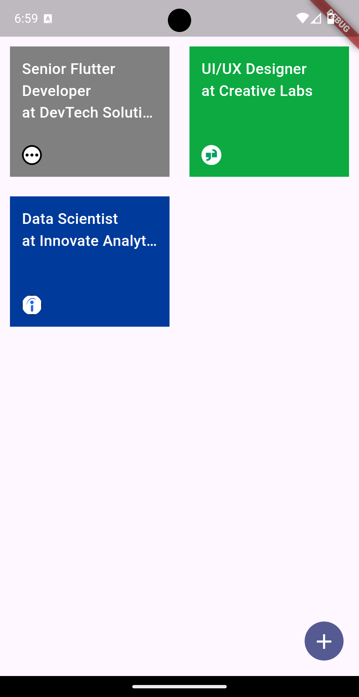
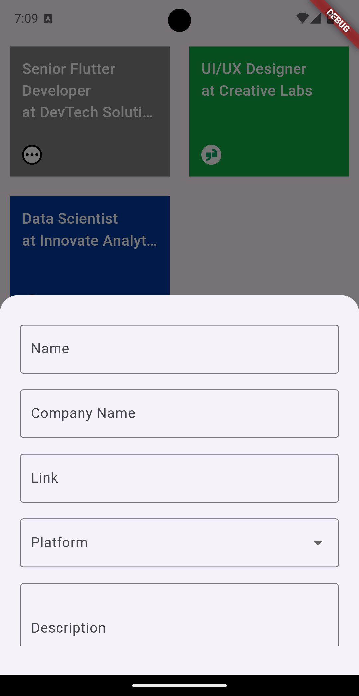
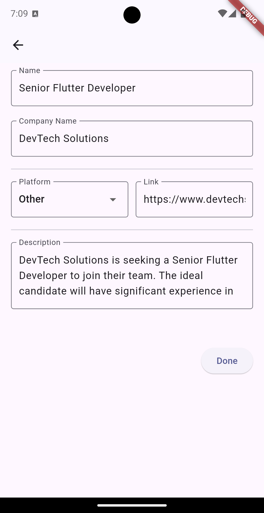

# Jobaya App

Jobaya is a Flutter application designed to manage and showcase job-related data, allowing users to add, edit, and view job information easily. The app integrates with a local SQLite database to store job entries, making it a practical solution for keeping track of various job-related details such as titles, descriptions, and other related data.

## Features

- **_Job Management:_** Add, edit, and delete job entries with detailed information.
  - Job Title
  - Job Description
  - Job Category
  - Date Added
- **_SQLite Integration:_** Uses a local SQLite database to store job data, making the app functional even without an internet connection.
- **_Responsive Design:_** Adaptable layout that supports different screen sizes, providing a consistent user experience.
- **_Dark/Light_** Theme Support: The app supports both dark and light themes to provide a comfortable viewing experience based on user preferences.
- **_Job Listing:_** Displays a list of all stored jobs with an option to view details and delete individual jobs using swipe.

## Screenshots

   

_Job Listing Screen:_ Browse and manage all your job entries with options to edit or delete.

   

_Job Info Screen:_ View detailed information about each job, including editing options.

_Edit Job Screen:_ Update job details with a user-friendly interface.
